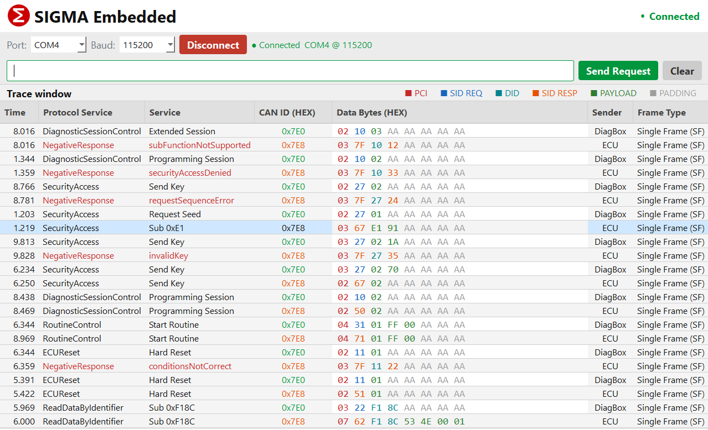
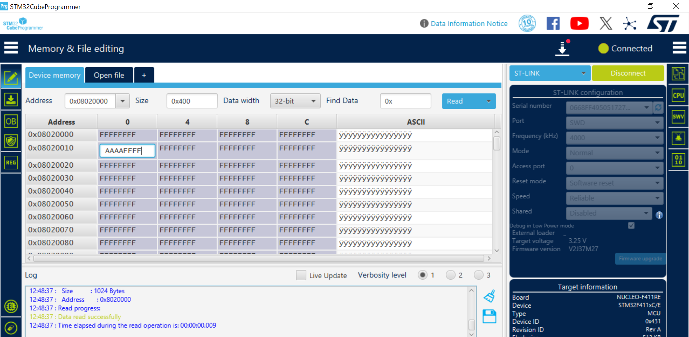
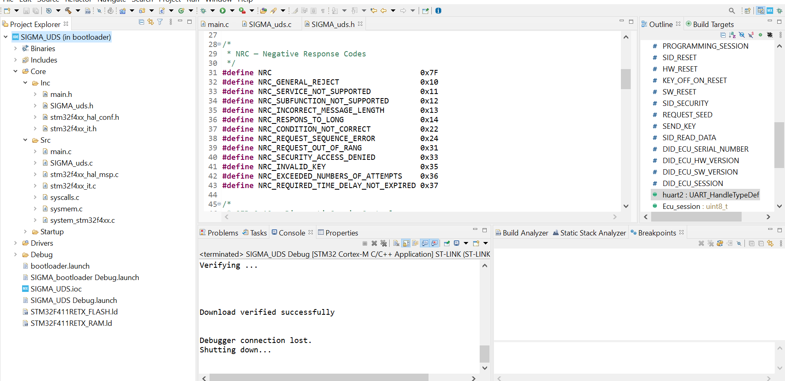

# UDS Bootloader — STM32F411RE (Nucleo)

> UART-based UDS (Unified Diagnostic Services) bootloader implemented on STM32F411RE Nucleo board, with a Python host terminal.

---

### Python Host Terminal — UI



> Interface allows sending raw UDS frames via UART. Each frame is color-coded by byte type (PCI, SID, DID, PAYLOAD, PADDING). Responses from ECU appear automatically via background reader thread.

---

### Erase Memory Test — 0x31 01 FF 00



> RoutineControl StartRoutine with RID=0xFF00 triggers flash erase. ECU responds with positive response `[71][01][FF][00]` if session and security conditions are met.

---

## Hardware

| Item | Value |
|---|---|
| Board | Nucleo-F411RE |
| MCU | STM32F411RETx |
| UART | USART2 (PA2/PA3 via ST-Link) |
| Baud Rate | 115200 |
| Clock | HSI → PLL → 100 MHz |

---

## Frame Format

### Tester → ECU (TX)

```
[ LEN ] [ SID ] [ SUB ] [ DATA (optional) ]
  1B      1B      1B       1B (if needed)
```

### ECU → Tester (RX) — always 8 bytes with 0xAA padding

```
[ LEN ] [ SID+0x40 or 0x7F ] [ ... ] [ 0xAA padding ]
```

---

## Supported Services

### 0x10 — DiagnosticSessionControl

| SUB | Name | Condition |
|---|---|---|
| 0x01 | DefaultSession | Always allowed |
| 0x02 | ProgrammingSession | `sec_unlocked == true` + `speed == 0` |

```
TX: [02][10][01]  →  RX: [02][50][01][AA×5]   Default
TX: [02][10][02]  →  RX: [02][50][02][AA×5]   Programming
TX: [02][10][02]  →  RX: [03][7F][10][33]     Security not unlocked
```

---

### 0x11 — ECUReset

> Only allowed in **ProgrammingSession**

| SUB | Name | Condition |
|---|---|---|
| 0x01 | HardReset | `flag == true` |
| 0x02 | KeyOffOnReset | `flag == true` |
| 0x03 | SoftwareReset | Always (in prog session) |

```
TX: [02][11][03]  →  RX: [02][51][03] + NVIC_SystemReset()
TX: [02][11][01]  →  RX: [03][7F][11][22]   flag == false
```

---

### 0x27 — SecurityAccess

**Flow:**

```
1. Tester → [02][27][01]              RequestSeed
   ECU    ← [03][67][seed_H][seed_L]  seed = HAL_GetTick() & 0xFFFF

2. Tester → [03][27][02][key]         SendKey  (key = seed_H ^ seed_L)
   ECU    ← [02][67][02]              Unlocked
         or ← [03][7F][27][35]        InvalidKey
         or ← [03][7F][27][36]        ExceededAttempts (3 tries max) → locked until reset
         or ← [03][7F][27][37]        TimeDelayNotExpired (> 60s)
```

**Key Algorithm:**
```c
uint8_t key = seed_H ^ seed_L;
```

---

### 0x22 — ReadDataByIdentifier

| DID | Name | Response |
|---|---|---|
| 0xF18C | ECU Serial Number | `SN0001` (4 bytes) |
| 0xF193 | HW Version | `0x10` = v1.0 |
| 0xF195 | SW Version | `0x21` = v2.1 |
| 0xF186 | Active Session | `0x01` or `0x02` |

```
TX: [02][22][F1][86]          →  RX: [04][62][F1][86][01]   Default session
TX: [04][22][F1][86][F1][93]  →  RX: [03][7F][22][14]       Response too long
```

### 0x31 — RoutineControl

| SUB | Name | Condition |
|---|---|---|
| 0x01 | StartRoutine | ProgrammingSession + sec_unlocked |

| RID | Name | Description |
|---|---|---|
| 0xFF00 | EraseMemory | Erase flash before download |
| 0xFF02 | CheckProgramming | Verify programmed data integrity |
---

### NRC Response Example

---

## Python Host Terminal

### Frame Builder

```python
def build_frame(payload):
    length = len(payload)
    frame = [length] + payload
    while len(frame) < 3:
        frame.append(0x00)   # minimum 3 bytes
    return bytes(frame)
```

---

## Known Limitations

- Frame max = 8 bytes (padding 0xAA)
- Security locked → reset hardware requis pour débloquer
- `speed` et `flag` variables — à connecter à la logique applicative réelle
- Seed = `HAL_GetTick()` — à remplacer par un vrai RNG en production

---

## Author

ARNOUZ SAID — 2026  
EMBEDDED ENGINEER